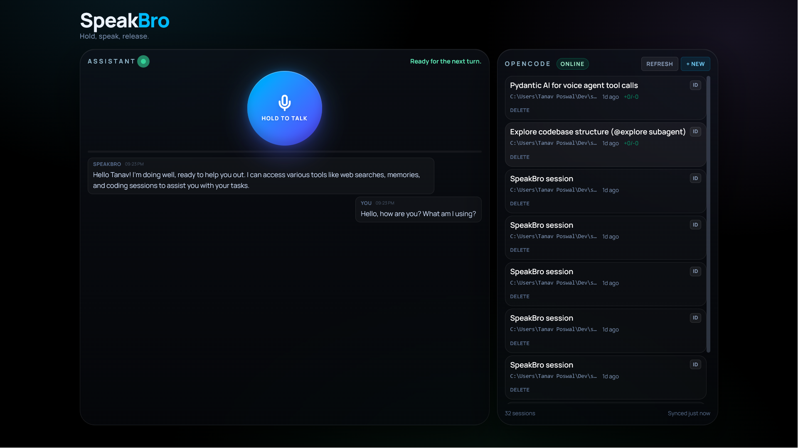

# SpeakBro



A **local-first AI voice assistant** with long-term memory. Speak, and it transcribes, thinks, and talks back — speech (STT + TTS) runs on your own hardware, and **SuperMemory** is the persistent brain across sessions.

## Why it's built this way

- **Privacy by default:** microphone audio never leaves your machine for transcription or voice synthesis. `faster-whisper` (tiny.en) handles STT, `piper-tts` (en_US-ryan-medium) handles TTS — both run locally on CPU.
- **Your brain, not the model's:** every meaningful fact is saved to and recalled from **SuperMemory** (`sm_project_speakbro` container), so SpeakBro remembers you across restarts and conversations. Relevant memories are proactively recalled before each reply — no explicit "remember" command needed.
- **Real actions, not just chat:** a Pydantic AI agent with tool-calling can search the web (Exa), check the time, and spin up/manage **OpenCode** coding sessions.
- **Flexible brain:** the LLM is pluggable via env vars (`LLM_BASE_URL` / `LLM_MODEL_NAME` / `LLM_API_KEY`). Defaults to a Groq-hosted model for low latency with no local GPU required; point it at a local Ollama endpoint to keep thinking fully on-device. Exa and OpenCode are optional — the assistant degrades gracefully if they're not configured.

## Architecture

```
Mic ──WebSocket/PCM──▶ React frontend ──▶ Python backend
                                                   │
                     ┌──────────────┬──────────────┼───────────────┐
                 faster-whisper   LLM (Groq/    Piper TTS      Pydantic AI agent
                 (STT, local)    Ollama/local)  (local)        ├─ search_memories ─▶ SuperMemory
                                                                 ├─ add_memory ──────▶ SuperMemory
                                                                 ├─ (proactive recall ▶ SuperMemory)
                                                                 ├─ web_search ──────▶ Exa (optional)
                                                                 └─ OpenCode tools ───▶ OpenCode server (optional)
```

## Backend (Python, `uv`)

```bash
cd backend
uv sync
uv run uvicorn backend.main:app --reload --port 8000
```

The LLM is configured via environment variables (see below). No local GPU required —
it defaults to a Groq-hosted model. To run fully on-device, set `LLM_BASE_URL` to your
Ollama endpoint (e.g. `http://127.0.0.1:11434/v1`) and `LLM_MODEL_NAME` to a pulled
model. SuperMemory is required; Exa and OpenCode are optional.

### Agent tools

| Tool                         | Purpose                                          |
| ---------------------------- | ------------------------------------------------ |
| `search_memories`            | Recall facts about you/entities from SuperMemory |
| `add_memory`                 | Persist important long-term facts to SuperMemory |
| `web_search`                 | Up-to-date info via Exa                          |
| `get_current_time`           | Current date/time (UTC)                          |
| `create_opencode_session`    | Start an OpenCode session for complex coding     |
| `list_opencode_sessions`     | List existing OpenCode sessions                  |
| `summarize_opencode_session` | Compress a long session's context                |

## Frontend (React + Vite + Tailwind v4)

```bash
cd frontend
npm install
npm run dev   # http://localhost:5173
```

- Hold **Space** to talk, release to send (push-to-talk).
- Streaming markdown chat via `streamdown`.
- OpenCode panel (right sidebar) with SSE live updates.
- Auto-reconnect with exponential backoff; tap during playback to interrupt.

## OpenCode (optional)

```bash
opencode serve --port 4096
```

The voice agent calls OpenCode only for complex/multi-step coding tasks or when you ask.

## Environment variables

| Variable                     | Required | Default                             | Description                                                                          |
| ---------------------------- | -------- | ----------------------------------- | ------------------------------------------------------------------------------------ |
| `SUPER_MEM_KEY`              | Yes      | —                                   | SuperMemory API key (swap for a Supermemory Local endpoint for fully private memory) |
| `LLM_API_KEY`                | Yes\*    | `GROQ_API_KEY` / `CEREBRAS_API_KEY` | API key for the LLM provider (\*any one of the three)                                |
| `LLM_BASE_URL`               | No       | `https://api.groq.com/openai/v1`    | OpenAI-compatible LLM endpoint                                                       |
| `LLM_MODEL_NAME`             | No       | `openai/gpt-oss-20b`                | Model name sent to the LLM endpoint                                                  |
| `EXA_API_KEY`                | No       | —                                   | Exa API key for web search (optional; assistant degrades without it)                 |
| `OPENCODE_API_URL`           | No       | `http://127.0.0.1:4096`             | Backend → OpenCode server (optional)                                                 |
| `VITE_OPENCODE_API_BASE_URL` | No       | `http://127.0.0.1:4096`             | Frontend → OpenCode API base (optional)                                              |

## Production build

```bash
cd frontend && npm run build
cd backend && uv run uvicorn main:app --port 8000
```

The backend serves `frontend/dist`. Open `http://localhost:8000`.

## Notes

- Audio is streamed as 16 kHz mono PCM while Space is held, finalized to WAV on release.
- A new OpenCode session is **not** auto-created on connect — the agent decides when coding help is needed.
- STT: `faster-whisper` `tiny.en` (CPU, int8). TTS: `piper-tts` `en_US-ryan-medium` (22050 Hz).
- Relevant memories are **proactively recalled** before each reply and shown as a toast, so SpeakBro "remembers you" without an explicit recall command.

## Demo tips

- Pre-seed durable facts so the memory demo is instant: `curl -X POST http://localhost:8000/memories/seed`
- Then ask (in a fresh session) "What do you remember about me?" to prove cross-session recall.
- The Memory tab shows every save/skip event; toasts also appear on save/recall.
