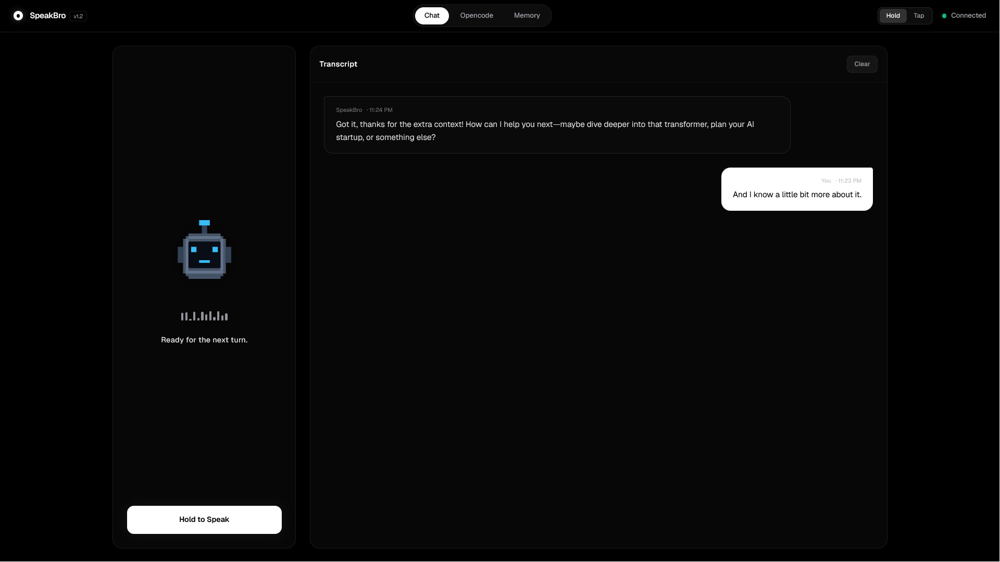

# SpeakBro



[Loom demo](https://www.loom.com/share/6d2f029295484bcda62a58d4f01d78cd) | [Demo video on X](https://x.com/tanavtwt/status/2077837126079807786)

SpeakBro is a local-first AI voice assistant with long-term memory. Hold Space to speak, and it transcribes your voice, reasons over the request, remembers useful facts, and speaks the answer back.

Speech-to-text and text-to-speech run locally on your machine. The language model is configurable: use the default Groq-compatible endpoint, or point SpeakBro at a local Ollama server. SuperMemory provides persistent memory across sessions.

## Features

- Push-to-talk voice interaction over a WebSocket
- Local speech recognition with `faster-whisper` (`tiny.en`, CPU/int8)
- Local speech synthesis with Piper (`en_US-ryan-medium`)
- Streaming markdown responses in the React UI
- Proactive long-term memory recall and durable-fact storage via SuperMemory
- Optional web search through Exa
- Optional OpenCode sessions for multi-step coding work
- Configurable OpenAI-compatible LLM endpoint
- Automatic WebSocket reconnect with interruption support

## Architecture

```text
Microphone
    |  16 kHz mono PCM over WebSocket
    v
React + Vite frontend -------> FastAPI backend
                                  |- faster-whisper (local STT)
                                  |- OpenAI-compatible LLM
                                  |- Piper (local TTS)
                                  |- SuperMemory (persistent memory)
                                  |- Exa (optional web search)
                                  `- OpenCode server (optional)
```

## Requirements

- Python 3.11 or newer
- [`uv`](https://docs.astral.sh/uv/)
- Node.js and npm
- A working microphone and speakers
- A SuperMemory API key
- An API key for the configured LLM provider, unless using a local endpoint that does not require one
- Optional: Exa API key and an OpenCode installation

## Configuration

Create a `.env` file in the repository root. The backend loads it automatically through `python-dotenv`.

```dotenv
SUPER_MEM_KEY=your-supermemory-key

# Defaults to Groq's OpenAI-compatible endpoint.
LLM_API_KEY=your-llm-api-key
# Alternatively, GROQ_API_KEY or CEREBRAS_API_KEY can be used.
LLM_BASE_URL=https://api.groq.com/openai/v1
LLM_MODEL_NAME=openai/gpt-oss-20b

# Optional web search.
EXA_API_KEY=your-exa-key

# Optional OpenCode server.
OPENCODE_API_URL=http://127.0.0.1:4096
VITE_OPENCODE_API_BASE_URL=http://127.0.0.1:4096
```

For a local Ollama-compatible LLM, use values such as:

```dotenv
LLM_BASE_URL=http://127.0.0.1:11434/v1
LLM_MODEL_NAME=your-ollama-model
LLM_API_KEY=ollama
```

`SUPER_MEM_KEY` is required for persistent memory. Exa and OpenCode are optional; the assistant continues to work without them. Keep `.env` out of version control.

## Run locally

Start the backend in one terminal:

```bash
cd backend
uv sync
uv run uvicorn main:app --reload --port 8000
```

Start the frontend in a second terminal:

```bash
cd frontend
npm install
npm run dev
```

Open [http://localhost:5173](http://localhost:5173). Vite proxies WebSocket and API requests to the backend at `http://127.0.0.1:8000`.

The backend health check is available at [http://localhost:8000/healthz](http://localhost:8000/healthz).

## OpenCode integration (optional)

Start an OpenCode server separately:

```bash
opencode serve --port 4096
```

SpeakBro creates or manages an OpenCode session only when the request needs multi-step coding work or you explicitly ask for it.

## Memory demo

With the backend running and `SUPER_MEM_KEY` configured, seed sample memories:

```bash
curl -X POST http://localhost:8000/memories/seed
```

Then start a fresh frontend session and ask, "What do you remember about me?" The Memory tab shows saved memories and recall activity.

## Agent tools

| Tool | Description |
| --- | --- |
| `search_memories` | Search durable facts in SuperMemory |
| `add_memory` | Save a durable fact to SuperMemory |
| `web_search` | Search the web through Exa when configured |
| `get_current_time` | Return the current UTC date and time |
| `create_opencode_session` | Start an OpenCode coding session |
| `list_opencode_sessions` | List available OpenCode sessions |
| `send_opencode_message` | Send work to an OpenCode session |
| `view_opencode_messages` | Read recent session messages |
| `summarize_opencode_session` | Compress a long OpenCode session |

Relevant memories are recalled before a response. SpeakBro saves only durable information such as preferences, identity details, recurring projects, or lasting constraints, not temporary moods, one-off plans, or casual conversation.

## Production build

Build the frontend and serve it with a static web server of your choice:

```bash
cd frontend
npm run build
npm run preview
```

Run the API separately in another terminal:

```bash
cd backend
uv run uvicorn main:app --host 0.0.0.0 --port 8000
```

If the frontend and backend are hosted on different origins, configure the frontend proxy or deployment routing so `/ws`, `/memories`, `/event`, and `/api` reach the backend.

## Repository layout

```text
backend/    FastAPI application, voice models, and Python dependencies
frontend/   React/Vite application
demo.png    Project screenshot
```
